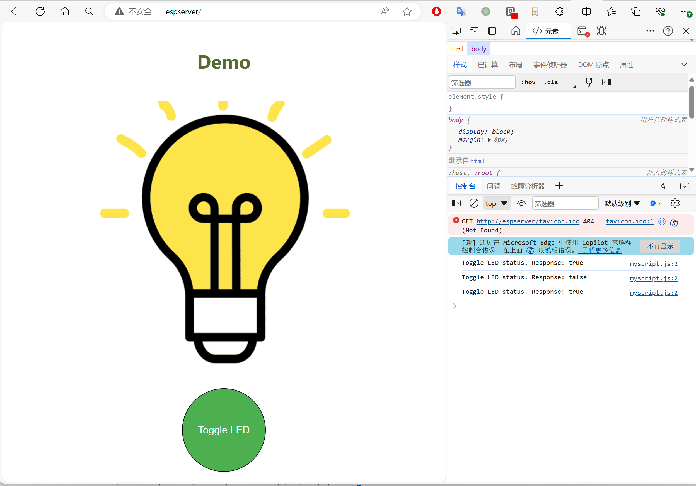

# Files to PROGMEM C string converter

[中文](readme_zh.md)
## Introduction
This script converts files to a C string that can be stored in PROGMEM and used in Arduino ESP8266 projects to build web server.

Usually an Arduino project stores files in Flash memory utilizing SPIFFS or LittleFS file system. Alternatively, this script can convert files to a C PROGMEM string enabling straightforward inclusion of resource files within the project build, bypassing the need for separate SPIFFS or LittleFS file uploaders.

Small onboard Flash chip may have a very tiny SPIFFS or LittleFS Filesystem so that storing files in PROGMEM may also help you to store larger files. Files stored in PROGMEM will share memory with your Code in flash (ICACHE_FLASH_ATTR, a.k.a Sketch). The maximum capacity of files in PROGMEM may be smaller or larger than SPIFFS or LittleFS file system, depends on the Flash layout of your board. You may find the detailed information in the [Arduino ESP8266 Filesystem](https://arduino-esp8266.readthedocs.io/en/latest/filesystem.html) document.

The capacity of the Code in flash can be found in the Arduino build log. For example:
```
. Code in flash (default, ICACHE_FLASH_ATTR), used 315092 / 1048576 bytes (30%)
║   SEGMENT  BYTES    DESCRIPTION
╚══ IROM     315092   code in flash
```

## Features
* Preserve the file name and file path so that the web server can serve the files with relative path.
* Minify HTML, CSS and Javascript files to reduce the size.
* GZIP Compression for HTML, CSS and Javascript files.
* A web server request handler to support generated PROGMEM contents and GZIP compression.
* Web Server examples by using ESPAsyncWebServer (for ESP32 and ESP8266) and ESP8266WiFi (for ESP8266 only)

## Supported Platforms
* Arduino ESP8266 and ESP32.
* Others may work with minor modifications.
* Tested boards:
  * ESP-01S.
  * ESP32 S3 Pico
* LED_BUILTIN definition
* Other development boards may need to modify the LED_BUILTIN definition in ESPAsyncWebServer.ino according to the onboard LED port.

## Usage
### Prepare python environment
import Conda environment.yml for python environment.

For example:
```
conda env create -f environment.yml -n c:\projects\FileToCString\.conda
conda activate c:\projects\FileToCString\.conda
```

Remember to replace `c:\projects\FileToCString` with your specific project path.

### Run the script to convert files into C file
 Under your project folder, execute the following command to convert files into C source code:
```
file_to_c.py <directory> [-r] [-c]
    directory: The directory contains the files to be converted.
    -o: Original file. The script will minify and gzip compress all HTML, JS and CSS files by default. Specify -o to skip minify and gzip compression.
```
For examples:
```
cd examples\esp8266
python ..\..\file_to_c.py webdata
```

Or
```
cd examples\ESPAsyncWebServer
python ..\..\file_to_c.py webdata
```


Note: This script must be executed one level above your web page directory. Otherwise, the generated relative paths will be incorrect.

### Understand output files.
The script generates `<directory>.h` and `<directory>.c` files in the same location as the executed command. HTML, CSS, and JavaScript files undergo compression before being stored as strings, whereas other files are stored in binary format. These outputs can be directly included in your project's codebase.

All files are stored in an array of `ProgmemFileInformation` structure:
```
extern const ProgmemFileInformation progmemFiles[];
```
ProgmemFileInformation is defined in ProgmemFileInformation.h
```
typedef struct ProgmemFileInformationStruct
{
    const char * file_path;
    const char * file_content;
    const int file_length;
    const char * content_type;
    const int is_compressed;
} ProgmemFileInformation;
```

* `file_path`: The file path relative to the `<directory>`.
* `file_content`: The file content in PROGMEM C string.
* `file_length`: The file length.
* `content_type`: The content type can be used by web server to serve the file.
* `is_compressed`: The file is gzip compressed or not.

In the generated example 'webdata.c' below, `css_style_css` is the PROGMEM C string of `/css/style.css`. The file is gzip compressed and stored in C byte array.
The script removed the root directory 'webdata' from the file path and added `/` to the beginning of the file path for the web server to serve the file.
```
const char v_css_style_css[] PROGMEM = 
{ 0x1f, 0x8b, 0x08, 0x00, 0x02, 0x08, 0x74, 0x66, 0x02, 0xff, 0x6d, 0x8e, ...}
const char text_css[] PROGMEM = "text/css";
const char css_style_css[] PROGMEM = "/css/style.css";
const ProgmemFileInformation progmemFiles[] = {
    { .file_path = css_style_css, .file_content = v_css_style_css, .file_length = 209, .content_type = text_css, .is_compressed = 1 },
...
}
```


### Use the generated C file in Web Server
Then you can open the web server projects from examples/ESPAsyncWebServer or examples/ESP8266WiFi folders.

They created an object of `ProgmemWebRequest` and pass the `progmemFiles` to the constructor.
```
const char *ignoredDirectories[] = {"/api", "/cgi-bin"};
server.addHandler(new ProgmemAsyncWebHandler(progmemFiles, ignoredDirectories, sizeof(ignoredDirectories)/sizeof(char*)));
```
Optionally, you may add dynamic web pages/APIs handlers under `/api` or `/cgi-bin`. See toggleLed() in example code to understand how to handle dynamic web pages.

Note: The default root request handler will serve the `index.htm` file in the `<directory>` folder.


### Build and upload to your device
Before buiding ino file from the example project, please remember to update `WIFI_SSID` and `WIFI_PASSWORD` in the config.h before compiling.

If everything works, you can open the web server at http://espserver and control the built-in LED by clicking the green button.


## Version History
* 1.2: Support ESP32 and ESPAsyncWebServer
* 1.1: Support GZIP compression. Paths and Content Types are also stored in PROGMEM.
* 1.0: Initial release

## License
The python script is under MIT license.

However, if you use the generated files within a GPL project, you have to use the GPL license for your project.
