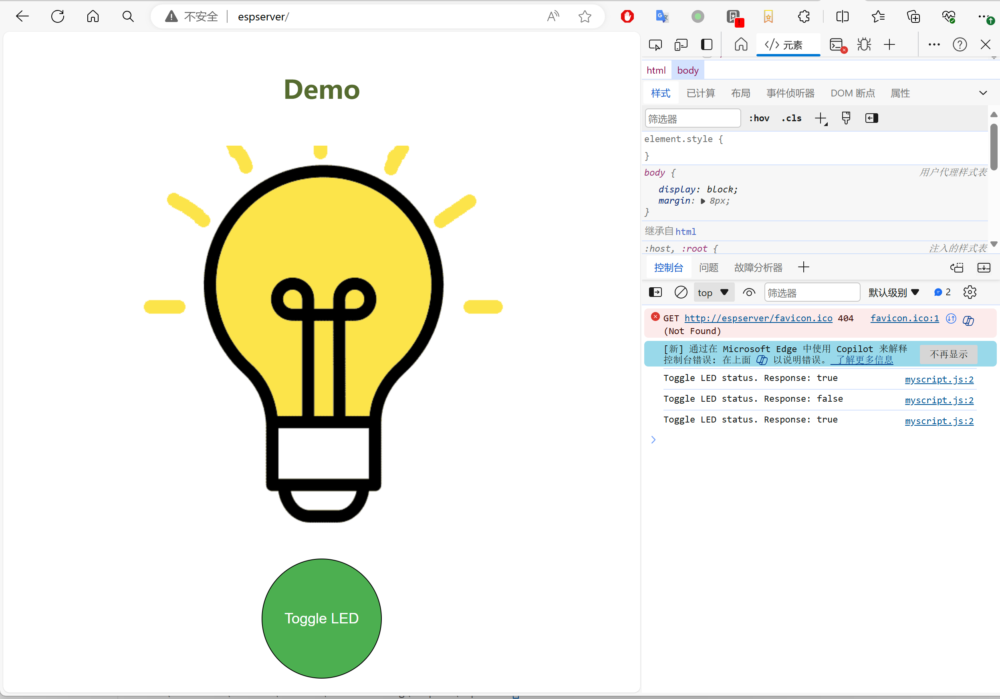

# 文件至PROGMEM C字符串转换器

## 引言
此脚本将文件转换为可存储于PROGMEM中的C字符串形式，可以用于在Arduino ESP8266工程中构建网站服务器。

通常Arduino项目通过SPIFFS或LittleFS文件系统在Flash存储器中保存文件。而此脚本提供了一种替代方案，能将文件转化为C语言的PROGMEM字符串，可以把资源文件直接整合进项目编译流程，无需另外采用SPIFFS或LittleFS文件上传工具。

对于搭载小容量Flash芯片的设备而言，其SPIFFS或LittleFS文件系统的空间可能极为有限，此时将文件存储于PROGMEM中，有助于容纳更大规模的文件。存入PROGMEM的文件会与Flash中的程序代码（标记为ICACHE_FLASH_ATTR，亦即“Sketch”）共用存储空间。PROGMEM所能存储文件的总量可能少于或多于SPIFFS或LittleFS文件系统，具体视开发板的Flash布局而定。关于这部分的详细信息，请参考[Arduino ESP8266文件系统](https://arduino-esp8266.readthedocs.io/zh_CN/latest/filesystem.html)文档。

Flash中程序代码的容量大小，可在Arduino的构建日志中查询到。例如：
```
. Code in flash (default, ICACHE_FLASH_ATTR), used 315092 / 1048576 bytes (30%)
║   SEGMENT  BYTES    DESCRIPTION
╚══ IROM     315092   code in flash
```

## 特性
* 保留文件名和文件路径，以便Web服务器能够以相对路径返回文件。
* 最小化HTML、CSS和JavaScript文件以减小体积。
* GZIP压缩HTML, CSS和Javascript文件.
* 提供Web服务器请求处理器以支持生成的PROGMEM文件以及GZIP压缩。
* 提供两个Web服务器示例：ESPAsyncWebServer (支持ESP32和ESP8266) 和ESP8266WiFi (支持ESP8266)

## 支持平台
* Arduino ESP8266和ESP32。已在ESP-01S上测试。

* 其他平台可能稍作修改后也可运行。

## 使用方法
### 准备Python环境

导入Conda环境配置文件environment.yml来配置Python环境。

例如：
```
conda env create -f environment.yml -n c:\projects\FileToCString\.conda
conda activate c:\projects\FileToCString\.conda
```

请记得把`c:\projects\FileToCString` 替换成你的项目目录。

### 运行脚本把文件转换成C文件
 
 在你的项目目录中，执行下面的命令把目录中的文件转换成C语言代码：
```
file_to_c.py <directory> [-r] [-c]
    directory: 包含资源文件的目录
    -o: 原始文件。默认脚本会缩小并压缩所有HTML, JS和CSS文件。指定-o则跳过缩小和压缩。
```
例如
```
cd examples\esp8266
python ..\..\file_to_c.py webdata
```

或
```
cd examples\ESPAsyncWebServer
python ..\..\file_to_c.py webdata
```
注意：必须在你的网页目录上一级执行这个脚本，否则生成的相对路径将不正确。


### 了解输出的文件
脚本会在执行命令的同一目录下生成`<directory>.h`以及`<directory>.c`文件。HTML、CSS 和 JavaScript 文件在作为字符串存储之前会进行压缩，而其他文件则以二进制格式存储。这些输出可以直接包含在项目的代码库中。

所有文件都存储在一个 `ProgmemFileInformation` 结构的数组中：
```
extern const ProgmemFileInformation progmemFiles[];
```
`ProgmemFileInformation`在`ProgmemFileInformation.h`中定义：
```
typedef struct ProgmemFileInformationStruct
{
    const char * file_path;
    const char * file_content;
    const int file_length;
    const char * content_type;
    const int is_compressed;
} ProgmemFileInformation;
```

* `file_path`: 相对于`<directory>`的路径。
* `file_content`: PROGMEM C字符串格式的文件内容。
* `file_length`: 文件长度。
* `content_type`: 用于web服务器的文件MIME类型。
* `is_compressed`: 文件是否是gzip压缩的。
  
在下面生成的范例'webdata.c'中, `css_style_css` 是PROGMEM C字符串格式的 `/css/style.css`文件，因为使用GZIP压缩因此是二进制数组格式。
脚本将`webdata`目录的路径从文件路径中删除，并将`/`添加到文件路径的开头，以便Web服务器能够以相对路径返回文件。
```
const char v_css_style_css[] PROGMEM = 
{ 0x1f, 0x8b, 0x08, 0x00, 0x02, 0x08, 0x74, 0x66, 0x02, 0xff, 0x6d, 0x8e, ...}
const char text_css[] PROGMEM = "text/css";
const char css_style_css[] PROGMEM = "/css/style.css";
const ProgmemFileInformation progmemFiles[] = {
    { .file_path = css_style_css, .file_content = v_css_style_css, .file_length = 209, .content_type = text_css, .is_compressed = 1 },
...
}
```


### 在Web服务器中使用生成的C文件
然后你就可以从examples/ESPAsyncWebServer 或 examples/ESP8266WiFi目录下打开工程

在范例工程里，它们创建了`ProgmemWebRequest`对象并在构造中使用`progmemFiles`作为输入.
```
const char *ignoredDirectories[] = {"/api", "/cgi-bin"};
server.addHandler(new ProgmemAsyncWebHandler(progmemFiles, ignoredDirectories, sizeof(ignoredDirectories)/sizeof(char*)));
```
可选的，你可以在`/api`或`/cgi-bin`路径下添加动态网页或者API接口。可以参考例子中toggleLed()的实现方法。


注意：默认根请求会读取`<directory>`目录下的`index.htm`。

### 构建并上传至设备
在编译ino文件之前，请务必在 `config.h` 文件中更新 `WIFI_SSID` 和 `WIFI_PASSWORD` 以匹配您的无线网络设置。

如果一切顺利，您可以通过访问 http://espserver 来打开web服务器，并通过点击绿色按钮来控制板上内置的LED灯。



## 版本历史
* 1.2: Support ESP32 and ESPAsyncWebServer
* 1.1: Support GZIP compression. Paths and Content Types are also stored in PROGMEM.
* 1.0: Initial release

## License
此脚本使用MIT许可证。

但是如果你在GPL项目中使用它生成的文件则必须以GPL许可证发布。